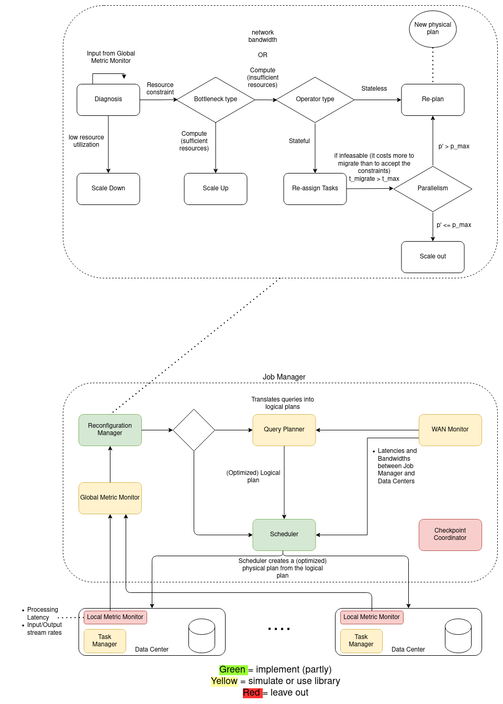

# WASP Implementation

## Design

The design is based on expanding Apache Flink [[1]](#1) with parts of the optimizations presented in WASP [[2]](#2). A visual representation of the full WASP implementation is depicted in [Figure 1](#FigDesign), with components that we are implementing in green, components that we are simulating in yellow, and components that we are not implementing as red.

The main component of our implementation is the Scheduler. The WASP paper does not describe a method to distribute the tasks among the nodes, but it does provide an instance of an Integer Linear Program problem. Solving said problem gives a result of how many tasks to run on every data center (node), depending on the current state of the system (bandwidths, latencies, available computation slots). Our Scheduler will schedule the tasks based on this result. We will use the Gurobi Optimization Tool [[3]](#3) to solve the ILP problem.

To make our scheduler adaptive (react to changes in bandwidth, computational power, etc.) we also implement the Reconfiguration Manager. This component decides whether a bottleneck is present and, based on some heuristics, decides what kind of action to take. 

The decided action from the Reconfiguration Manager is used as input by the Scheduler to calculate a new execution plan for the query(s) currently running on the system.

Initially, we will simulate all monitoring components, as well as the actual execution of queries on the data centers. We will use Flink to provide queries and streams of data to our Job Manager.

Due to time constraints for completion of this project, we do not consider checkpointing. If a task is rescheduled, it must be executed again from the beginning.

The WASP paper describes three techniques to adapt the execution plan to the state of the system: Task re-assignment, Operator scaling, and Query re-planning. Our Scheduler and Reconfiguration Manager components implement the first two techniques. We decided to leave out Query re-planning due to time constraints, and only consider the one logical plan we receive from the simulated Query Planner.

<a id="FigDesign">*Figure 1:*</a>
*A visual representation of the WASP implementation, with components that we are implementing in this project depicted in green.*

### Functional Requirements

* The system should be able to identify the bottlenecks and take the appropriate actions as mentioned below.
    * Reconfiguration due to computational resources - If the computational resources are the bottleneck for a particular operator, the algorithm should first attempt to scale up (increase resources within the same site), and then scale out (distribute the workload on a greater number of sites). On the other hand, if excess resources are allocated to an operator, the algorithm should scale down.
    * Reconfiguration due to bandwidth/latency - If the upstream bandwidth of a particular node is the bottleneck, the upstream node should limit the stream sent to that node. The plan should be restructured to utilize links with higher bandwidths.
* Reconfiguration should be possible, not only at the start of each execution, but also when the execution is in progress.

### Non-Functional Requirements

* Data quality - No data degradation (no throwing away parts of the stream if it cannot be processed fast enough or sacrificing accuracy, only as last resort).
* Streaming Data - The system should handle data that continuously flows to it at different speeds.
* Scalability - Nodes shall utilize resources within a certain boundary (not going above or below a certain threshold). Parallelism can be increased by scaling up/out the operators.
* Distribution - Distributing tasks to be processed amongst different machines on multiple data centers.
* Processing Guarantees - The submitted query shall be executed, and the result retrieved within a certain finite amount of time.
* Flow Control - The system should be able to handle effectively the nodes work overload.

## Evaluation

To evaluate the execution of the adaptive strategy, we submit a number of queries and measure how well it performs. The queries only consist of simple stateless tasks. 

At specified intervals, we introduce changes to the input stream rate, bandwidths of different links, and the computational power of different data centers.

We will use the same metrics as the paper, which are 
1. The delay in seconds from submitting the query and obtaining the results.
2. The ratio between the stream input rate and the processing rate.

The baseline is the scheduler without reconfiguring any of the task placements after the initial schedule vs. WASP reconfiguring task placement based on collected metrics from the data centers.

We use the Yahoo Streaming Benchmark (YSB) [[4]](#4) to asses our system under large workloads.

## References 

<a id="1">[1]</a>
The Apache Software Foundation. Apache Flink. DOI:https://flink.apache.org/ 

<a id="2">[2]</a>
Albert Jonathan, Abhishek Chandra, and Jon Weissman. 2020. WASP: Wide-area Adaptive Stream Processing. In Proceedings of the 21st International Middleware Conference (Middleware '20). Association for Computing Machinery, New York, NY, USA, 221–235. DOI:https://doi-org.tudelft.idm.oclc.org/10.1145/3423211.3425668

<a id="3">[3]</a>
Gurobi Optimization, LLC. Gurobi Optimization Tool. 2021. DOI:http://www.gurobi.com

<a id="4">[4]</a>
Yahoo. Yahoo Streaming Benchmark. 2020. DOI:https://github.com/yahoo/streaming-benchmarks